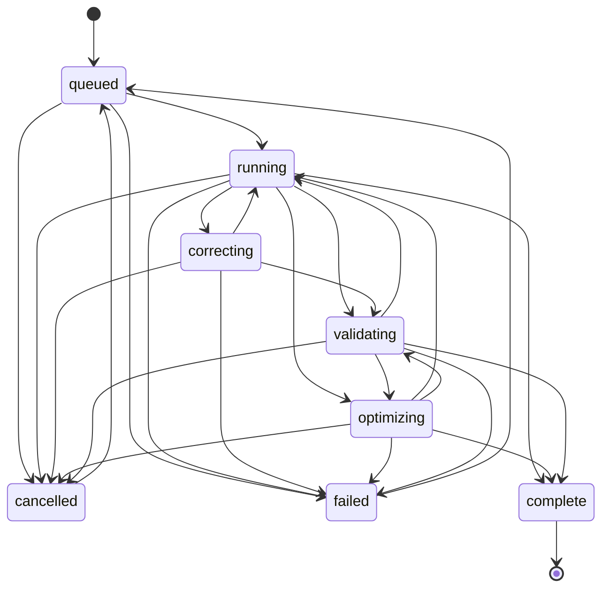
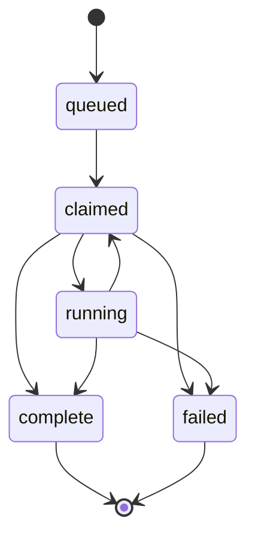

# Canonical State Machine

This document is authoritative for DeepRun lifecycle transitions. It is generated from `src/agent/lifecycle-graph.ts`, and tests fail if the checked-in doc drifts from the canonical graph data.

## Agent Lifecycle Run State Machine

| State | Allowed Transitions |
| --- | --- |
| `queued` | `cancelled`, `failed`, `running` |
| `running` | `cancelled`, `complete`, `correcting`, `failed`, `optimizing`, `validating` |
| `correcting` | `cancelled`, `failed`, `running`, `validating` |
| `optimizing` | `cancelled`, `complete`, `failed`, `running`, `validating` |
| `validating` | `cancelled`, `complete`, `failed`, `optimizing`, `running` |
| `complete` | `(terminal)` |
| `failed` | `queued` |
| `cancelled` | `queued` |

Notes:
- Resume is explicit: only failed and cancelled runs may transition back to queued.
- Terminal states are complete, failed, and cancelled.

## Durable Run Job State Machine

| State | Allowed Transitions |
| --- | --- |
| `queued` | `claimed` |
| `claimed` | `complete`, `failed`, `running` |
| `running` | `claimed`, `complete`, `failed` |
| `complete` | `(terminal)` |
| `failed` | `(terminal)` |

Notes:
- running -> claimed is the lease-expiry reclaim edge.
- complete and failed are terminal job outcomes.
