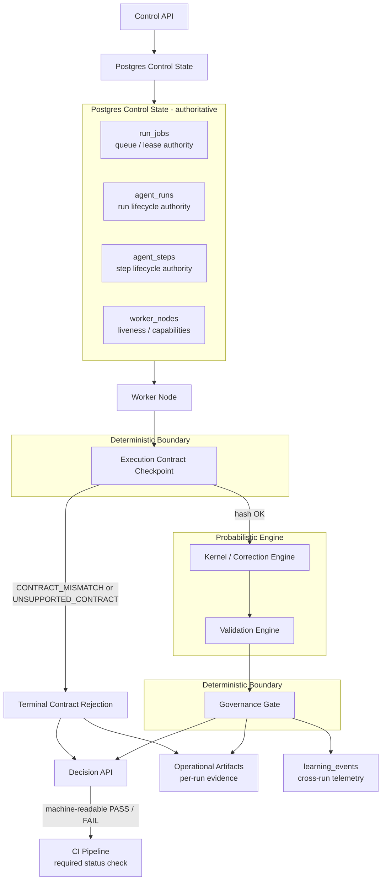

# DeepRun Whitepaper

## Abstract

DeepRun is a deterministic governance boundary around probabilistic software correction and validation. It is designed so that autonomous or semi-autonomous software work can be executed under durable orchestration, constrained by a versioned execution contract, validated against explicit gates, and exposed to external CI through a machine-readable decision payload rather than through logs or human interpretation.

The core architectural claim is simple: probabilistic systems may operate inside DeepRun, but authority does not. Authoritative control state is persisted in Postgres, each run executes under a content-addressed contract, and governance decisions are computed from persisted run state only. This makes DeepRun closer to a governed execution platform than a conventional coding agent.

## The Problem

Most agentic software systems fail in one of four ways:

- control state exists in memory instead of in an authoritative store
- execution behavior drifts across resumes, workers, or deployments
- correctness and policy are conflated into ad hoc tool output or logs
- CI integration depends on console text instead of a stable machine contract

These are not prompting problems. They are systems problems.

DeepRun addresses them by separating:

- probabilistic planning, correction, and validation behavior
- deterministic control state, contracts, and governance decisions

## What DeepRun Is

DeepRun is a governed execution system for AI-assisted software work. In its current form, it provides:

- a control API for creating and managing runs
- a durable Postgres-backed queue and worker model
- a correction engine with validation and remediation logic
- persisted execution contracts and contract-aware resume/fork behavior
- a governance gate that emits versioned, content-addressed decision payloads
- operational artifacts and analytical learning telemetry
- a reliability benchmark and proof-pack system

DeepRun is not just a code generator. It is an execution substrate for governed software mutation.

## Core Architectural Statement

DeepRun is a deterministic governance boundary around probabilistic software correction and validation, in which all authoritative control state is persisted in Postgres, execution is constrained by a versioned, content-addressed contract, and external CI consumes a machine-readable decision derived solely from persisted run state.

## Engineering Laws

These laws are the architectural invariants that prevent drift.

### Law 1: Authority Law

No behavior-affecting control state may influence execution or governance unless it has first been persisted in Postgres.

Implications:

- no in-memory-only authority
- no hidden runtime flags that can change governance outcomes
- no worker-local state may decide run status or external pass/fail results

### Law 2: Contract Law

Every run executes under a versioned, content-addressed execution contract. Any behavior-affecting contract mutation creates a new contract identity.

Implications:

- no silent environment drift
- no implicit default mutation changing behavior across workers
- resume preserves the contract unless override or fork is explicit

### Law 3: Decision Law

Governance decisions must be computed solely from persisted run state and must be reproducible from the same persisted state snapshot.

Implications:

- no dependency on worker memory
- no dependency on current wall-clock timing quirks
- no dependency on external telemetry as a governance input
- no log scraping requirement for CI

## High-Level Runtime Architecture

## Control State Model

DeepRun’s authority does not live in workers or in the kernel process. It lives in persisted Postgres records.

### Postgres as the authoritative control-state store

- `run_jobs`: queue ownership, claim state, lease state
- `agent_runs`: run lifecycle state and execution contract identity
- `agent_steps`: step lifecycle state
- `worker_nodes`: worker liveness and capability state

Workers execute. They do not own state.

## Execution Contract

Each run executes under a persisted execution contract. That contract is normalized, versioned, and hashed before meaningful work begins.

The contract includes:

- execution contract schema version
- normalized execution configuration
- determinism policy version
- planner policy version
- correction recipe version
- validation policy version
- randomness seed specification

The worker checkpoint performs:

1. load persisted execution config
2. normalize it
3. compute contract material and contract hash
4. assert equality with stored contract metadata
5. refuse execution on mismatch or unsupported material

This makes contract identity enforceable, not descriptive.

## Validation and Governance Are Separate

Validation and governance have different responsibilities.

Validation determines whether the current run output satisfies correctness checks.

Governance determines whether the run should be accepted externally.

A run may pass validation and still fail governance if other persisted conditions fail, for example:

- strict readiness checks fail
- pinned commit provenance is missing
- contract support is invalid

This separation is essential. Correctness checking is not the same thing as acceptance policy.

## Governance Decision Contract

DeepRun exposes a versioned governance decision payload. This is the external contract for CI and release automation.

Current payload shape:

- `decisionSchemaVersion`
- `decision`
- `reasonCodes`
- `reasons`
- `runId`
- `contract`
- `artifactRefs`
- `decisionHash`

`decisionHash` is content-addressed:

`decisionHash = sha256(canonicalJson(payloadWithoutHash))`

That gives CI a stable machine contract. CI can act on:

- `decision`
- `reasonCodes`
- `contract.hash`

without reading logs.

## Operational Evidence vs Analytical Telemetry

DeepRun persists two different evidence layers:

### Operational artifacts

Per-run evidence, such as:

- worktree outputs
- validation targets
- governance decision files
- stress gate artifacts

These are diagnostic and run-scoped.

### Analytical telemetry

Cross-run learning telemetry, such as:

- `learning_events`
- correction phase outcomes
- delta / regression / convergence metrics
- stress and benchmark summaries

These are analytical, not authoritative for governance.

This distinction prevents telemetry from becoming an accidental governance input.

## Upgrade Semantics

In-flight runs execute under their persisted contract identity.

This implies:

- runs must finish under the contract hash they were created or explicitly resumed under
- new deployments must not silently mutate in-flight run behavior
- workers may reject unsupported future contract material
- resume preserves contract identity unless override or fork is explicit

This is what makes clustered upgrades and multi-worker execution safe.

## Reliability and Benchmark Proof

DeepRun’s architecture is backed by a proof-pack benchmark, not just unit tests.

Latest successful proof pack:

- `proofPackSchemaVersion = 1`
- `proofPackHash = 635fb4e580e36f232c6e9ab9044ce7b94e2646382bc534114f4378c1f340d1e8`

The successful benchmark covered:

- Phase 1: contract and behavior-affecting-surface hardening
- Phase 2: public PASS and FAIL governance decision paths
- Phase 3:
  - normal soak: `300` runs
  - negative controls: `4`
  - legal-slow sessions: `5`
  - worker-death reclaim repetitions: `5`
- Phase 4:
  - canonical state-machine conformance
  - artifact-contract verification
  - artifact-retention proof

The proof pack itself is also content-addressed and versioned.

## Current Guaranteed Properties

DeepRun currently guarantees:

- deterministic governance decisions for identical persisted terminal run state
- content-addressed governance decisions via `decisionHash`
- CI can act purely on the governance payload rather than on logs
- fail-closed behavior for execution-contract and governance-gate invariant violations

This last claim is intentionally scoped. DeepRun does not yet claim universal fail-closed behavior for every conceivable invariant in the system.

## What DeepRun Is Not Claiming Yet

DeepRun does not yet claim:

- universal fail-closed behavior across every future subsystem
- append-only run ledger as the sole evidence model
- fully role-separated planner / executor / verifier runtime architecture
- microVM-backed isolation as the current default execution layer

Those are future hardening layers, not current claims.

## Strategic Positioning

The strategic claim behind DeepRun is that probabilistic systems become operationally trustworthy only when constrained by deterministic infrastructure.

That means the product advantage is not “better prompting.” It is:

- authoritative state
- explicit contracts
- deterministic governance
- machine-readable decisions
- proof-oriented reliability evaluation

This is what makes DeepRun suitable as a required status check in CI, not merely as an assistant.

## Conclusion

DeepRun’s core architectural move is simple: keep the generative parts probabilistic, but place them inside deterministic rails that own authority, contract identity, and external acceptance.

If that boundary is maintained, DeepRun remains governable even as models, correction strategies, and execution environments evolve. That is the basis for a reliability-first platform.
